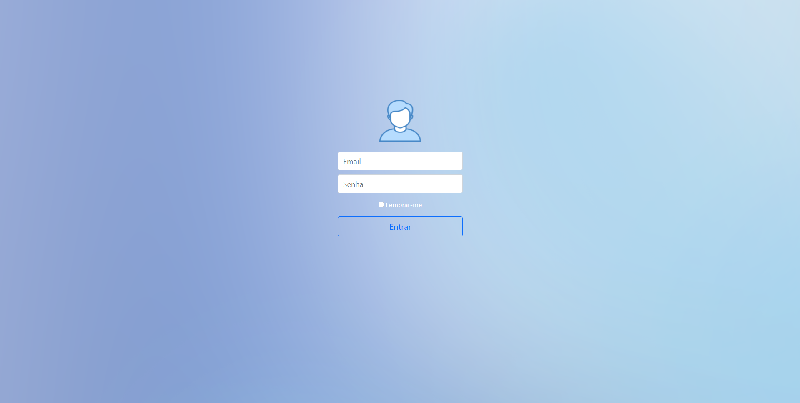

# Tela de login do usuário utilizando email e senha

O projeto consiste básicamente em demonstrar o Login do usuário utilizando seu email e senha em um sistema privado.

Foram usados no projeto:

* PHP 
* MySQL
* HTML
* CSS
* Bootstrap

Vizualização da tela:

Atenciosamente, dev-ansouza.
